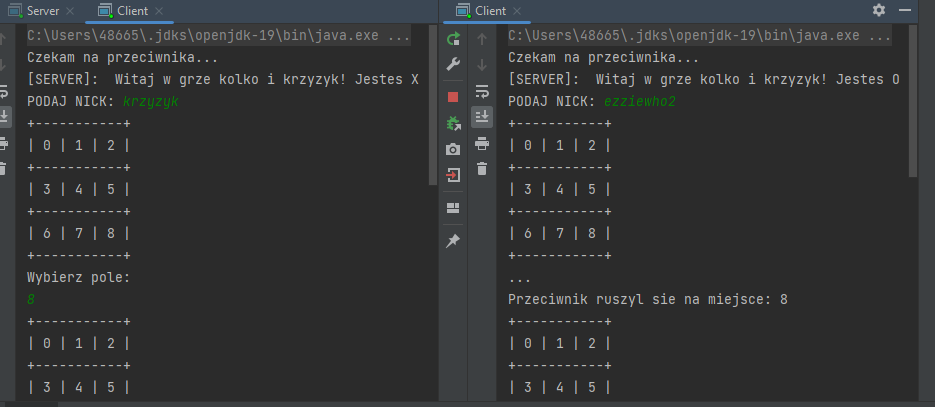
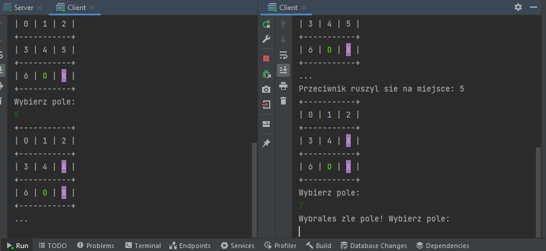
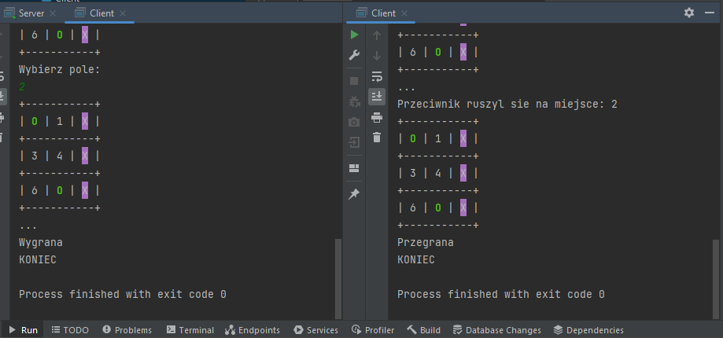
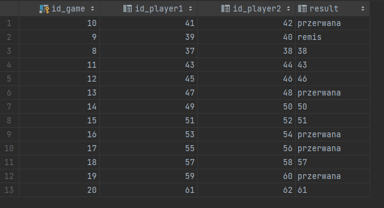
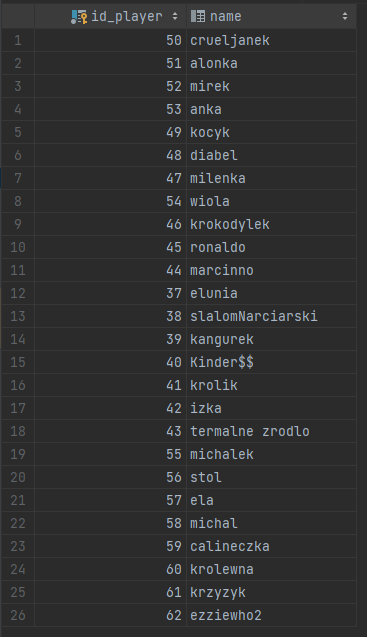

# TicTacToe
Multi-client interactive java app implementing TicTacToe game created as a part of the "Desktop and Mobile Application Programming" course.

The application enables users to play multiple two-player Tic-Tac-Toe games using socket programming. It also utilizes the Hibernate library to establish a connection with a database and interact with it seamlessly.

- At the beginning of the game, each player, upon receiving the information about whether they are playing as "X" or "O," provides their nickname. After entering the nicknames, the player representing "X" makes the first move to start the game.

- Each player is presented with a game board displaying the moves made so far. The program is designed to handle user errors, such as selecting an incorrect field or making a move out of turn.

- After the game concludes, each player is notified of the result, which can be a win, loss, or draw. If one of the players decides to exit the game prematurely, it is recorded in the table as "interrupted."

___
The program operates on multiple threads, allowing for the simultaneous play of multiple two-player games. This enables concurrent gameplay, as multiple games can be played concurrently.
___

 
## Tables, where the results are recorded after the matches.

- The "Game" table contains information about the played games, including the game ID, IDs of both players, and the outcome of the game.

- The "Players" table contains the IDs and nicknames of the players.

